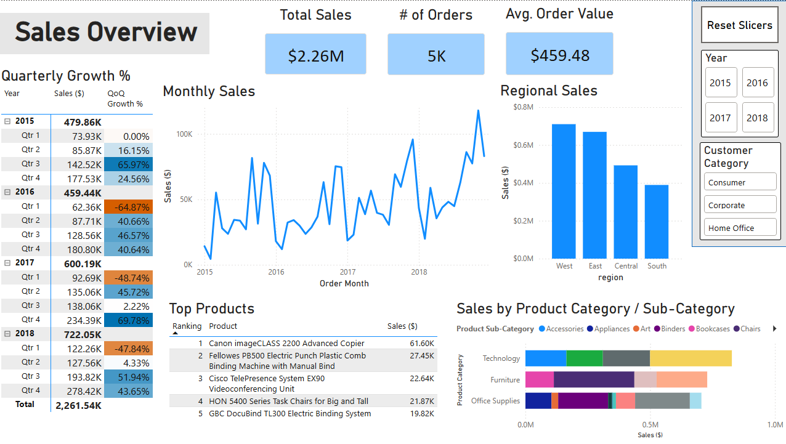
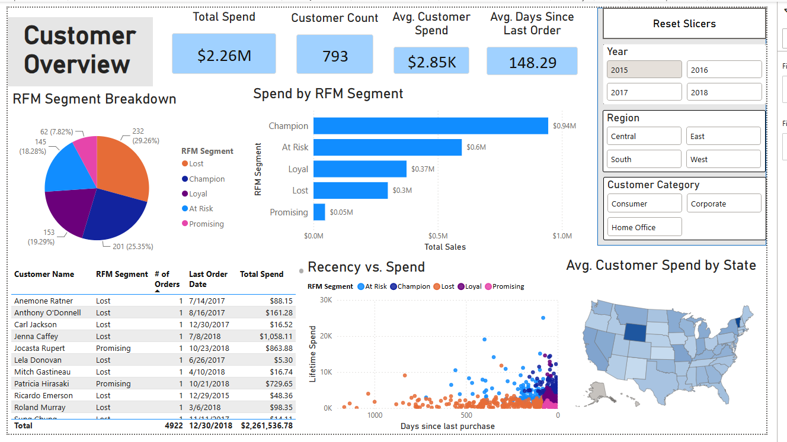

# Superstore Sales Analytics

An end-to-end data analytics pipeline built on the Superstore dataset. 
The project covers data cleaning, customer segmentation, SQL data modelling, 
and an interactive Power BI dashboard designed for business users.

## Business Questions

1. **How are sales trending?** — by region, category, and over time
2. **Which customers are most valuable?** — using RFM (Recency, Frequency, Monetary) segmentation
3. **Which customers are we at risk of losing?** — identifying At Risk and Lost segments before churn occurs

## Tech Stack

- **Python** — data cleaning, RFM analysis, XGBoost sales forecast, data loading via SQLAlchemy
- **PostgreSQL** — star schema design (fact + dimension tables), indexes, reporting view
- **Power BI** — two-page interactive dashboard with DAX measures and cross-filtering

## Project Structure

```
SuperstoreAnalytics/
    python/          # Jupyter notebook: cleaning, RFM, forecast, SQL load
    sql/
        01_schema.sql    # Table definitions
        02_indexes.sql   # Query performance indexes
        03_views.sql     # Reporting view for Power BI
    images/          # Dashboard screenshots
    requirements.txt
```

## Dashboard

**Page 1 — Sales Overview**
KPI cards, quarterly growth table, monthly sales trend, 
sales by category and region, top products. 

**Page 2 — Customer Health**
KPI cards, RFM segment breakdown, customer detail table with recency and lifetime spend. 
Designed to surface at-risk customers before they churn.




## Key Design Decisions

- **Star schema in SQL** — orders fact table linked to customers, products, 
and geography dimension tables. Reflects a production pipeline where data 
would refresh regularly.
- **Reporting view** — `orders_enriched` pre-joins all dimension tables so 
Power BI reads a clean flat table rather than managing joins itself. 
Join logic belongs in the data layer, not the BI tool.
- **RFM segmentation** — customers scored 1-4 on recency, frequency, and 
monetary value and grouped into Champions, Loyal, Promising, At Risk, 
and Lost segments.
- **Forecast excluded from dashboard** — an XGBoost regional sales forecast 
was built (MAPE ~40%) but excluded from the dashboard given the limited 
training data (~140 rows after feature engineering). The pipeline is included 
to demonstrate end-to-end ML workflow.

## How to Run
0. Clone this repo: `git clone https://github.com/m-r-horan/superstore-analytics.git`
1. Install PostgreSQL and create a database called `superstore_analytics`
2. Run `sql/01_schema.sql` to create tables
3. Run `sql/02_indexes.sql` and `sql/03_views.sql`
4. Create a `.env` file with `DB_PASSWORD=yourpassword`
5. Install Python dependencies: `pip install -r requirements.txt`
6. Run the Jupyter notebook end to end
